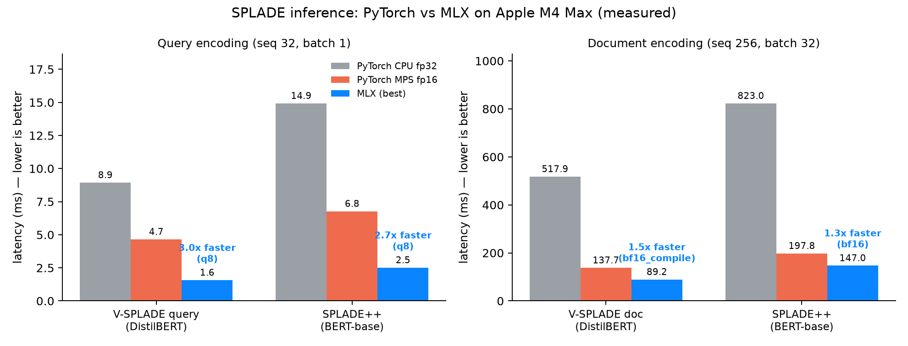
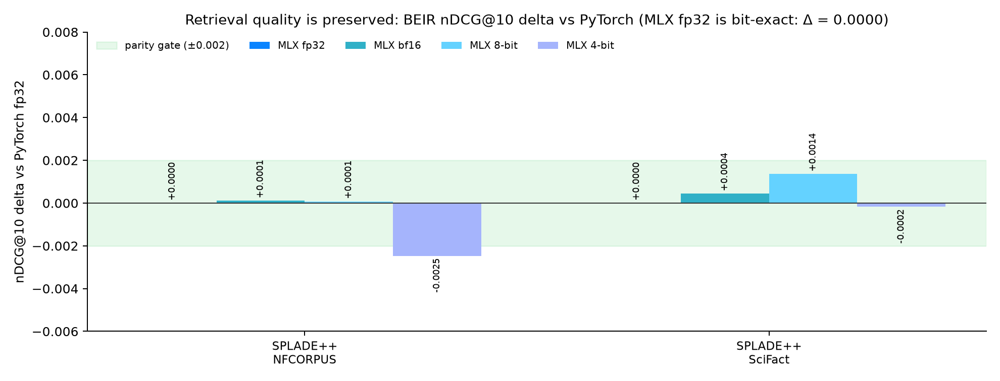

# SPLADE-mlx

**SPLADE sparse retrieval models, natively on Apple Silicon with [MLX](https://github.com/ml-explore/mlx).**

> **V-SPLADE (visual) port landed**: this repository now includes an MLX port of
> NAVER's inference-free **multimodal** sparse retriever for **visual document
> retrieval** ([arXiv:2605.30917](https://arxiv.org/abs/2605.30917),
> `naver/v-splade-{efficient,quality}`, ModernVBERT backbone, Apache-2.0):
> SigLIP vision tower + pixel-shuffle connector + ModernBERT encoder + SPLADE head,
> with an inference-free static query lookup. fp32 parity vs PyTorch: max logit delta
> 1.5e-04 (efficient) / 6.4e-04 (quality), cosine 1.000000; ViDoRe `docvqa` nDCG@5
> identical to the torch fp32 reference (see [REPORT.md](REPORT.md)).
> API: `splade_mlx.convert_vsplade.load_vsplade` (full docs ship with the next update).





*All numbers above are measured on an Apple M4 Max (12P+4E, 64 GB). The latency chart
compares **matched precision only** (fp32 vs fp32, fp16 vs bf16), so the speedup is
attributable to MLX itself — not to quantization. Quantization is an optional extra
(it helps at batch 1, and is actually slower than bf16 at large batches). MLX fp32
reproduces the PyTorch fp32 nDCG@10 to the last floating-point digit on BEIR NFCorpus
and SciFact — the ranking is identical, not just close. bf16 and 8-bit stay within
±0.0014.*

## Highlights

- **1.3–2.9x faster at matched precision** (fp32 vs fp32 and bf16 vs MPS fp16); up to
  **7.3x** vs PyTorch CPU
- **Bit-exact quality** in fp32, verified with three parity gates plus full BEIR evaluations
- BERT and DistilBERT MLM backbones, asymmetric query/doc pair API, bf16 / 8-bit / 4-bit quantization
- Pre-converted weights ready on the Hugging Face Hub (table below)

Full methodology and tables: [REPORT.md](REPORT.md) · Project plan: [PLAN.md](PLAN.md)

## Supported models

| MLX weights (Hugging Face) | Upstream checkpoint | Backbone | fp32 parity (max logit Δ) | License |
|---|---|---|---|---|
| [NomaDamas/splade-cocondenser-ensembledistil-mlx](https://huggingface.co/NomaDamas/splade-cocondenser-ensembledistil-mlx) | [naver/splade-cocondenser-ensembledistil](https://huggingface.co/naver/splade-cocondenser-ensembledistil) | BERT-base | 6.1e-05 | CC BY-NC-SA 4.0 |
| [NomaDamas/splade-v3-mlx](https://huggingface.co/NomaDamas/splade-v3-mlx) | [naver/splade-v3](https://huggingface.co/naver/splade-v3) (gated) | BERT-base | 7.6e-05 | CC BY-NC-SA 4.0 |
| [NomaDamas/splade-v3-doc-mlx](https://huggingface.co/NomaDamas/splade-v3-doc-mlx) | [naver/splade-v3-doc](https://huggingface.co/naver/splade-v3-doc) (gated) | BERT-base | 4.8e-05 | CC BY-NC-SA 4.0 |
| [NomaDamas/splade-v3-lexical-mlx](https://huggingface.co/NomaDamas/splade-v3-lexical-mlx) | [naver/splade-v3-lexical](https://huggingface.co/naver/splade-v3-lexical) (gated) | BERT-base | 3.1e-05 | CC BY-NC-SA 4.0 |
| [NomaDamas/splade-v3-distilbert-mlx](https://huggingface.co/NomaDamas/splade-v3-distilbert-mlx) | [naver/splade-v3-distilbert](https://huggingface.co/naver/splade-v3-distilbert) | DistilBERT | 5.8e-05 | CC BY-NC-SA 4.0 |
| [NomaDamas/Splade_PP_en_v1-mlx](https://huggingface.co/NomaDamas/Splade_PP_en_v1-mlx) | [prithivida/Splade_PP_en_v1](https://huggingface.co/prithivida/Splade_PP_en_v1) | BERT-base | 5.5e-05 | **Apache-2.0** |

Every row passed the same fp32 parity gates before upload: max MLM-logit delta < 1e-3,
sparse-vector cosine ≥ 0.9999, and top-64 expansion-term overlap ≥ 99% vs the PyTorch
reference. Any other BERT / DistilBERT `*ForMaskedLM` SPLADE checkpoint can be converted
with `splade_mlx.convert` as well.

> The `naver/*` weights are **non-commercial** (CC BY-NC-SA 4.0). For commercial use,
> pick `Splade_PP_en_v1-mlx` (Apache-2.0).

## Install

```bash
uv sync   # or: pip install -e .
```

## Usage

```python
import mlx.core as mx
from splade_mlx import load, load_pair

# Symmetric SPLADE (one encoder for queries and documents).
# Accepts a pre-converted MLX repo, or an original HF checkpoint id
# (converted to MLX on first use and cached).
model, tok = load("NomaDamas/splade-v3-mlx")
enc = tok(["what causes vitamin d deficiency"], return_tensors="np", padding=True)
sparse = model.encode(mx.array(enc["input_ids"]), mx.array(enc["attention_mask"]))  # (1, 30522)

# Asymmetric pairs (separate query / document encoders), e.g. SPLADE-v3-Doc:
pair = load_pair("NomaDamas/splade-v3-mlx", "NomaDamas/splade-v3-doc-mlx")
q = pair.encode_query(["what causes vitamin d deficiency"])
d = pair.encode_doc(["Vitamin D deficiency is commonly caused by ..."])
score = q @ d.T  # sparse dot product

# Quantization (see the quality chart above for the impact).
model, tok = load("NomaDamas/splade-v3-mlx", quantize_bits=8)
```

## Benchmarks

Measured with an identical harness on both frameworks: same tokenizer, same real
NFCorpus texts, fixed-length padding, warm-up plus adaptive repetitions (12–50, up to
8 s per config), and explicit synchronization (`torch.mps.synchronize()` /
`mx.eval()`). Tokenization time is excluded and reported separately (~0.1 ms/query).
Nothing else ran during measurement; all configs were executed sequentially. Full grid:
[REPORT.md](REPORT.md) and `results/*.json`.

### Matched precision (the fair comparison)

Both sides run at the **same numeric precision**, so the speedup below is attributable
to the MLX port itself — no quantization involved:

| precision | model | workload | PyTorch MPS | MLX | speedup |
|---|---|---|---|---|---|
| fp32 | splade-cocondenser | query, batch 1 | 7.15 ms | 3.96 ms | **1.81x** |
| fp32 | splade-cocondenser | query, batch 32 | 60.01 ms | 22.64 ms | **2.65x** |
| fp32 | splade-cocondenser | doc L256, batch 32 | 230.85 ms | 176.96 ms | **1.30x** |
| fp32 | splade-cocondenser | doc L256, batch 64 | 463.38 ms | 358.86 ms | **1.29x** |
| 16-bit¹ | splade-cocondenser | query, batch 1 | 6.77 ms | 3.32 ms | **2.04x** |
| 16-bit¹ | splade-cocondenser | query, batch 32 | 57.21 ms | 20.07 ms | **2.85x** |
| 16-bit¹ | splade-cocondenser | doc L256, batch 32 | 197.83 ms | 147.03 ms | **1.35x** |
| 16-bit¹ | splade-cocondenser | doc L256, batch 64 | 393.32 ms | 294.81 ms | **1.33x** |

¹ PyTorch runs fp16 on MPS; MLX uses bf16 (its recommended half precision). Same bit
width, near-identical numerics — both stay within ±0.0014 nDCG@10 of fp32.

The gap widens as workloads get smaller (batch 1–32 queries): MPS kernel-dispatch
overhead dominates small launches, which is exactly the single-query path that
bottlenecks interactive search. `mx.compile` adds only another 0–6% on top (large GEMMs
dominate), and is excluded from the table above for symmetry — no `torch.compile` was
used on the PyTorch side either.

### Quantization (optional extra, not part of the comparison above)

MLX does **not** require quantization — it is an opt-in flag (`quantize_bits=8|4`):

- **8-bit**: best single-query latency — 2.51 ms vs 3.32 ms bf16 (splade-cocondenser,
  batch 1). At large batches it is *slower* than bf16 (212.5 ms vs 147.0 ms,
  cocondenser doc L256 batch 32) because dequantization overhead outweighs bandwidth
  savings in compute-bound regimes. Quality stays within +0.0014 nDCG@10.
- **4-bit**: for memory-constrained deployment (85 MB for BERT-base). Quality dips
  slightly outside the ±0.002 parity gate on one benchmark cell (−0.0025, NFCorpus /
  SPLADE++) — use only when memory matters more than the last fraction of nDCG.
- PyTorch bars have no quantized counterpart because there is no practical int8
  inference path on the MPS backend; this asymmetry is why quantized results are kept
  out of the headline comparison.

### Quality

Evaluated on two public BEIR benchmarks — **NFCorpus** (3.6k docs, 323 test queries)
and **SciFact** (5.2k docs, 300 test queries) — by encoding the full corpus with each
backend and ranking with the sparse dot product (nDCG@10, trec_eval-style linear gain).
MLX fp32 reproduces the PyTorch fp32 score to the last floating-point digit on every
dataset × model cell (see the chart above). Absolute scores match published SPLADE
results, which independently validates the pipeline.

### Reproduce

```bash
uv run python -m bench.save_reference                      # torch fp32 parity references
uv run python -m bench.bench_torch --backend cpu --dtype fp32
uv run python -m bench.bench_torch --backend mps --dtype fp32
uv run python -m bench.bench_torch --backend mps --dtype fp16
uv run pytest tests/                                       # numeric parity gates
uv run python -m bench.eval_beir                           # BEIR nDCG@10 parity
uv run python -m bench.bench_mlx --dtype bfloat16          # (--compile / --quantize-bits 8|4)
uv run python -m bench.report                              # markdown comparison tables
uv run python scripts/make_charts.py                       # README charts
```

## License

Code: [Apache-2.0](LICENSE).

Model weights keep their upstream licenses (see the table above):
`naver/*` checkpoints are CC BY-NC-SA 4.0 (© NAVER Corp, non-commercial, redistributed
as adapted material under the same license); `prithivida/Splade_PP_en_v1` is Apache-2.0.
This project is not affiliated with or endorsed by NAVER.
